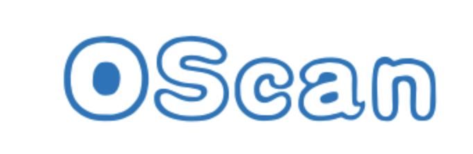
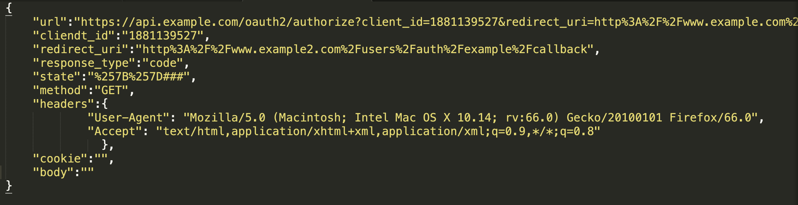
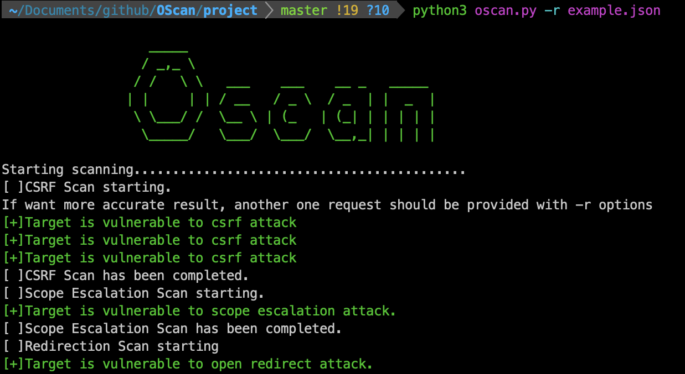

<p align="center">
  <a href="https://wpscan.org/">
    
  </a>
</p>

<p align="center">
  OAuth Web Application Security Scanner
  <br>
</p>

<p align="center">
  <a target="_blank"></a>
  <a target="_blank"></a>
</p>

## Description
This is a tool for scanning the vulnerabilities of the OAuth2.0 implementations on the web. According to the multipart (ie, Client, User, Authorization Server and Resource Server) interations, serveral attacks has been divided.

## Prerequisites

Install and start the server of mongodb. 

```
mongod -dbpath /tmp/mongodata/ -logpath /tmp/mongodata/mongo.log -logappend -fork -port 27017
```

Install the requirements.

```
pip install -r requirements.txt
```


## Done

- [x] CSRF.
- [x] Scope Privilege Escalation.
- [x] Open Redirection.
- [x] Same Original Redirection with Referer.
- [x] Authorization Code Middle Attack.


## Todo
- [ ] Covert Redirection.
- [ ] Same Original Redirection with XSS.
- [ ] Access Token Middle Attack.
- [ ] Same Original Redirection with remote image.


## Usage

Use `-h` options to see all the usage.


The API to be detected is best given in the following JSON format. If you think it is complex, you can also provide only one url with `-u` options instead. It will consume more time and get a false negative result. 

exec the command

```
python oscan.py -r example.json
python oscan.py -u http://api.xxx.com/xxx
```

## Example


